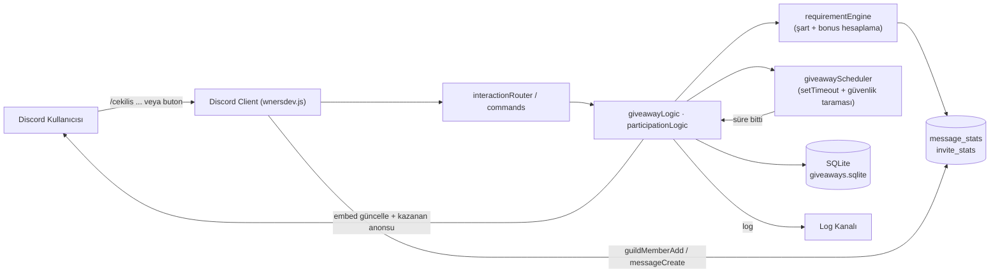
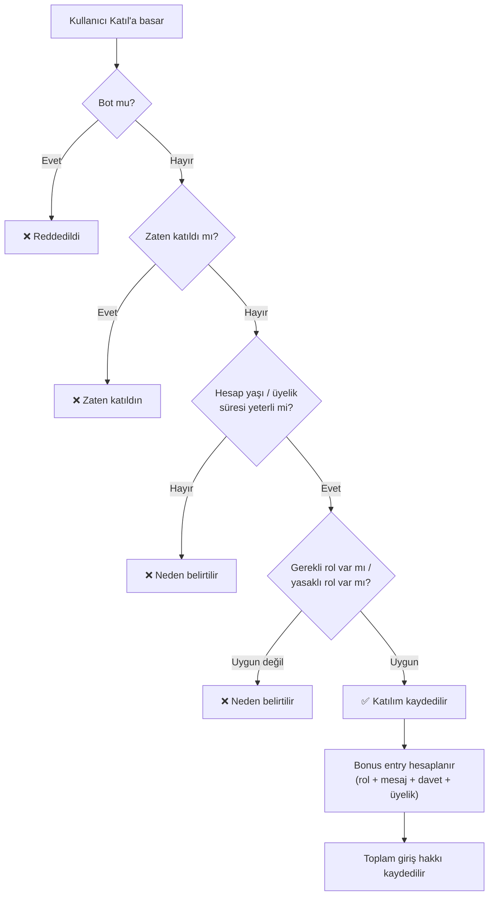

<div align="center">


<br/>


**Tamamen komut + buton tabanlı, sıfır web arayüzlü, production seviyesinde bir çekiliş botu.**
Taslak oluştur, gözden geçir, başlat. Sonrası tamamen otomatik. 🎉

</div>

<br/>

## 📚 İçindekiler

- [🎬 Komutlar Aksiyonda](#-komutlar-aksiyonda)
- [✨ Neden Bu Bot?](#-neden-bu-bot)
- [🏗️ Mimari](#️-mimari)
- [⚡ Hızlı Başlangıç](#-hızlı-başlangıç)
- [⚙️ ayarlar.json — Satır Satır](#️-ayarlarjson--satır-satır)
- [🎮 Komut Referansı](#-komut-referansı)
- [⏱️ Süre Formatı](#️-süre-formatı)
- [🎯 Katılım Şartları & Bonus Entry](#-katılım-şartları--bonus-entry)
- [🔁 Yaşam Döngüsü](#-yaşam-döngüsü)
- [🛡️ Güvenlik & Anti-Abuse](#️-güvenlik--anti-abuse)
- [📂 Klasör Yapısı](#-klasör-yapısı)
- [❓ SSS](#-sss)

<br/>

## 🎬 Komutlar Aksiyonda

> 🎥 Aşağıdaki 9 kutu gerçek komut kullanım gif'leri için ayrılmış yer tutuculardır — ben binary video/gif üretemiyorum, ama sen 10-15 saniyelik ekran kayıtlarını [ScreenToGif](https://www.screentogif.com/) (Windows) ya da `Peek` / `Kap` (Linux) ile alıp `docs/gifs/` klasörüne bırakınca README otomatik olarak canlanacak. Dosya adları aşağıda hazır — birebir eşleştir, değiştirecek tek şey ekran kaydının kendisi.

<table>
<tr>
<td width="33%" align="center">

**1️⃣ Çekiliş Oluşturma**
`/cekilis olustur`
<br/>

</td>
<td width="33%" align="center">

**2️⃣ Başlatma**
`/cekilis baslat`
<br/>

</td>
<td width="33%" align="center">

**3️⃣ Katılma**
🎉 buton / `/cekilis katil`
<br/>

</td>
</tr>
<tr>
<td width="33%" align="center">

**4️⃣ Katılımcılar**
👥 buton (sayfalama)
<br/>

</td>
<td width="33%" align="center">

**5️⃣ Uzat / Kısalt**
`/cekilis uzat` · `kisalt`
<br/>

</td>
<td width="33%" align="center">

**6️⃣ Duraklat / Devam**
`/cekilis duraklat` · `devam`
<br/>

</td>
</tr>
<tr>
<td width="33%" align="center">

**7️⃣ Bitirme & Kazanan**
`/cekilis bitir`
<br/>

</td>
<td width="33%" align="center">

**8️⃣ Yeniden Çekiliş**
`/cekilis yenidencek`
<br/>

</td>
<td width="33%" align="center">

**9️⃣ Sıfırlama (Onaylı)**
`/cekilis sifirla`
<br/>

</td>
</tr>
</table>

<div align="center">

</div>

<br/>

## ✨ Neden Bu Bot?

| | |
|---|---|
| 💾 **Restart-safe** | Bot yeniden başlasa da aktif çekilişler ve sayaçlar `SQLite`'tan geri yüklenir |
| ⏱️ **Akıllı zamanlama** | Her çekiliş için tek `setTimeout` + 60 saniyelik güvenlik taraması — saniye saniye tarama yok |
| 🎯 **Gerçek şartlar** | Hesap yaşı, üyelik süresi, gerekli/yasaklı rol, kanal erişimi — hepsi canlı kontrol ediliyor |
| 🎁 **Gerçek bonus entry** | Rol, mesaj sayısı, davet sayısı, üyelik süresi — hepsi veritabanına dayalı, sahte değil |
| 🔀 **İki adımlı akış** | `olustur` taslak oluşturur, `baslat` yayınlar — yayınlamadan önce gözden geçirme şansı |
| 🧾 **Log kanalı** | Her önemli olay (oluşturma, başlatma, bitirme, iptal, reroll) log kanalına düşer |

<br/>

## 🏗️ Mimari



<br/>

## ⚡ Hızlı Başlangıç

```bash
# 1. Bağımlılıkları kur
npm install

# 2. ayarlar.json'u doldur (token, clientId, guildId...)

# 3. Slash komutlarını yayınla
npm run deploy-commands

# 4. Başlat 🎉
npm start
```

> 💡 `guildId` boş bırakılırsa komutlar **global** kaydedilir (yayılması saatler sürebilir). Test ederken `guildId` girmen çok daha hızlı olur.

### Discord Developer Portal

1. [discord.com/developers/applications](https://discord.com/developers/applications) → **New Application**
2. **Bot** → token al → `ayarlar.json → token`
3. **Bot → Privileged Gateway Intents** → **SERVER MEMBERS INTENT**'i aç ⚠️ *(üyelik/davet bonusları bunsuz çalışmaz)*
4. **OAuth2 → General** → Client ID → `ayarlar.json → clientId`
5. Botu davet ederken izinler: `Send Messages`, `Embed Links`, `Read Message History`, `Use Slash Commands`, `Manage Messages`

<br/>

## ⚙️ ayarlar.json — Satır Satır

```jsonc
{
  "token": "",              // Discord bot token'ı — başka hiçbir dosyada bulunmaz
  "clientId": "",           // Uygulama ID
  "guildId": "",            // Boşsa global, doluysa tek sunucu
  "logChannelId": "",       // Olay logları buraya düşer
  "colors": { "success": "#2DD4BF", "error": "#EF4444", "info": "#7C6CFF", "warning": "#F5A623" },
  "giveaway": {
    "defaultWinners": 1,        // /cekilis olustur'da kazanan_sayisi verilmezse
    "maxWinners": 50,           // İzin verilen maksimum kazanan
    "allowCreatorJoin": false,  // Sahibi varsayılan olarak katılamaz
    "adminPermission": "ManageGuild" // Yönetici alt komutları için gereken izin
  },
  "bonusEntries": {
    "roles": [ { "roleId": "123...", "entries": 2 } ],
    "messageBonus": { "enabled": false, "messagesRequired": 100, "entries": 2, "cooldownSeconds": 30 },
    "inviteBonus": { "enabled": false, "invitesRequired": 3, "entries": 3 },
    "membershipBonus": { "enabled": false, "days": 30, "entries": 1 }
  },
  "requirementDefaults": { "minAccountAgeDays": 0, "minMembershipDays": 0 },
  "database": { "path": "./data/giveaways.sqlite" },
  "scheduler": { "safetySweepSeconds": 60 }
}
```

<br/>

## 🎮 Komut Referansı

<details open>
<summary><b>👑 Yönetici Komutları</b> (varsayılan: <code>ManageGuild</code> izni)</summary>

| Komut | Ne yapar |
|---|---|
| `/cekilis olustur` | Ödül, süre, kazanan sayısı, şartlar ve bonusları belirleyip **taslak** oluşturur (henüz yayınlanmaz) |
| `/cekilis baslat id:` | Taslağı ilgili kanala gönderir, sayacı başlatır |
| `/cekilis bitir id:` | Aktif/duraklatılmış çekilişi hemen sonlandırır, kazananı seçer |
| `/cekilis iptal id:` | Kazanan seçmeden çekilişi iptal eder |
| `/cekilis yenidencek id:` | Yeni kazanan seçer — `eskilerdahil:true` ile eski kazananlar da havuza girer |
| `/cekilis duzenle id:` | Ödül, kazanan sayısı, gerekli/yasaklı rolleri günceller |
| `/cekilis uzat id: sure:` / `kisalt id: sure:` | Süreyi anlık olarak uzatır/kısaltır, zamanlayıcı yeniden kurulur |
| `/cekilis duraklat id:` / `devam id:` | Sayaç donar/devam eder, `katilimi_kapat` ile katılım da kapatılabilir |
| `/cekilis temizle id:` | Aktif olmayan bir çekiliş kaydını veritabanından siler |
| `/cekilis sifirla` | Sunucudaki tüm geçmişi siler — **onay butonlu**, aktif çekilişler dokunulmaz |
| `/cekilis kopyala id:` | Var olan bir çekilişi yeni taslak olarak çoğaltır |

</details>

<details open>
<summary><b>🙋 Herkesin Kullanabildiği Komutlar</b></summary>

| Komut | Ne yapar |
|---|---|
| `/cekilis katil id:` / `cik id:` | Katılır / ayrılır (şartlar otomatik kontrol edilir) |
| `/cekilis bilgi id:` | Ödül, süre, kazanan sayısı, şartlar, sahip, katılımcı sayısı |
| `/cekilis sartlar id:` | Sadece katılım şartlarını gösterir |
| `/cekilis kazananlar id:` | Sona ermiş bir çekilişin kazananları |
| `/cekilis katilimcilar id:` | Herkese sayı, yetkiliye sayfalanmış tam liste |
| `/cekilis liste durum:` | Sunucudaki çekilişleri duruma göre listeler |
| `/cekilis gecmis kullanici:` | Geçmiş çekilişleri (opsiyonel kullanıcı filtresiyle) gösterir |

</details>

Çekiliş mesajındaki **🎉 Katıl · 👥 Katılımcılar · ℹ️ Bilgi** butonları aynı mantığı kullanır — komut yazmaya gerek yok.

<br/>

## ⏱️ Süre Formatı

| Kısa | Okunabilir |
|---|---|
| `10s`, `30s` | `30 saniye` |
| `1m`, `10m` | `10 dakika` |
| `1h`, `6h` | `6 saat` |
| `1d`, `3d` | `3 gün` |
| `1w` | `1 hafta` |
| — | `1 saat 30 dakika`, `2 gün 4 saat` gibi birleşik ifadeler de desteklenir |

<br/>

## 🎯 Katılım Şartları & Bonus Entry



<br/>

## 🔁 Yaşam Döngüsü

```
draft ──baslat──▶ active ──duraklat──▶ paused ──devam──▶ active
  │                  │                                     │
  │               bitir/süre dolar                     bitir
  ▼                  ▼                                     ▼
(kopyala)          ended ◀──────────── yenidencek ─────────┘
                     │
                  temizle / sifirla ──▶ (kayıt silinir)

herhangi bir aşamada → iptal ──▶ cancelled
```

<br/>

## 🛡️ Güvenlik & Anti-Abuse

- ✅ Bot hesapları otomatik reddedilir
- ✅ Aynı kullanıcı bir çekilişe iki kez giremez
- ✅ Tüm yönetici alt komutlarında izin kontrolü (`ManageGuild` varsayılan, `ayarlar.json`'dan değiştirilebilir)
- ✅ SQLite parametreli sorgular — enjeksiyon riski yok
- ✅ Kazanan seçimi ve süre değişiklikleri tek zamanlayıcı üzerinden yönetilir — çakışan bitirme riski azaltılmıştır
- ✅ Hatalar kullanıcıya asla stack trace olarak gösterilmez, log kanalına düşer
- ✅ Sıfırlama gibi geri alınamaz işlemler onay butonu ister

<br/>

## 📂 Klasör Yapısı

```text
wnersdev.js               🚪 Ana giriş dosyası
ayarlar.json              ⚙️ Tüm yapılandırma

commands/cekilis.js        💬 21 alt komut

events/
├── ready.js                📡 Cache + zamanlayıcı yükleme
├── interactionCreate.js     🎯 Komut/buton yönlendirme
├── guildMemberAdd.js        📥 Davet bonusu tespiti
├── messageCreate.js         💬 Mesaj bonusu sayacı
├── inviteCreate.js / inviteDelete.js  🔗 Davet cache güncelleme

handlers/
├── giveawayLogic.js         🎁 Oluştur/başlat/bitir/iptal/reroll/pause/resume/extend
├── giveawayScheduler.js     ⏰ setTimeout + güvenlik taraması
├── giveawayView.js          🖼️ Embed + buton üretimi
├── participationLogic.js    🙋 Katılma/çıkma
├── participantsView.js      👥 Sayfalanmış katılımcı listesi
├── requirementEngine.js     🎯 Şart + bonus hesaplama
├── interactionRouter.js     🔀 Buton yönlendirme
└── inviteTracker.js          🔗 Davet cache karşılaştırma

database/
├── db.js                   💾 SQLite şema
├── giveawayRepository.js    📦 Çekiliş CRUD
└── statsRepository.js       📊 Mesaj/davet sayaçları

utils/  config · duration · embeds · permissions · idGenerator · snowflake · logger
```

<br/>

## ❓ SSS

<details>
<summary><b>Neden "oluştur" ve "başlat" ayrı komutlar?</b></summary>
<br/>
Böylece ödülü, süreyi ve şartları yazdıktan sonra yayınlamadan önce <code>/cekilis bilgi</code> ile kontrol edebilirsin. Hata yaptıysan <code>duzenle</code> ile düzeltip öyle <code>baslat</code> dersin.
</details>

<details>
<summary><b>Bot çökerse veya yeniden başlarsa çekilişler kaybolur mu?</b></summary>
<br/>
Hayır. Tüm çekiliş verisi SQLite'a yazılır. Açılışta <code>ready.js</code>, aktif/duraklatılmış tüm çekilişleri okuyup zamanlayıcıları yeniden kurar; süresi çoktan dolmuş olanları da anında sonlandırır.
</details>

<details>
<summary><b>Davet bonusu neden çalışmıyor?</b></summary>
<br/>
İki şey gerekli: Developer Portal'da <b>SERVER MEMBERS INTENT</b>'in açık olması ve <code>ayarlar.json → bonusEntries.inviteBonus.enabled</code>'ın <code>true</code> olması.
</details>

<br/>

---

<div align="center">


</div>
